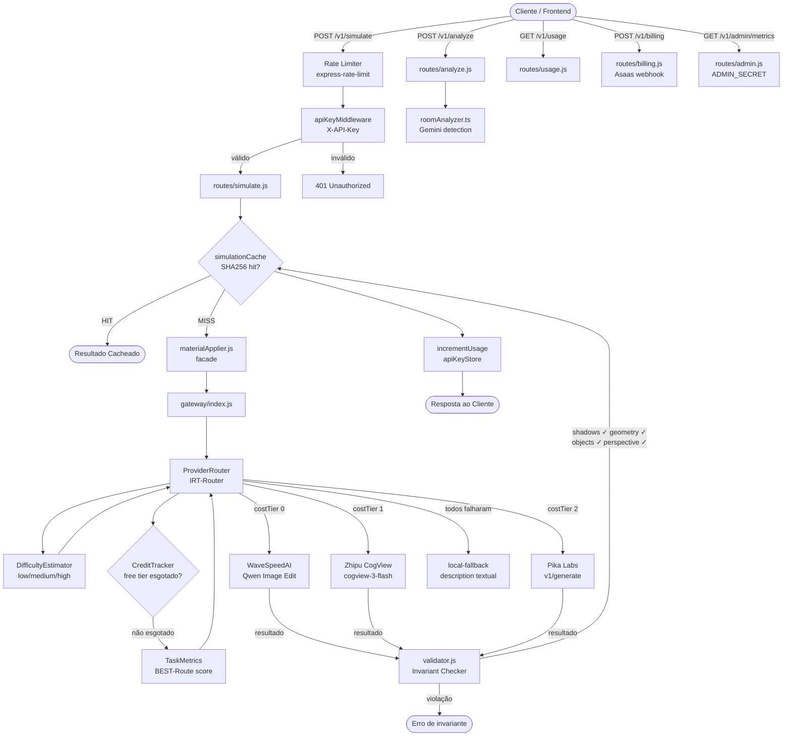
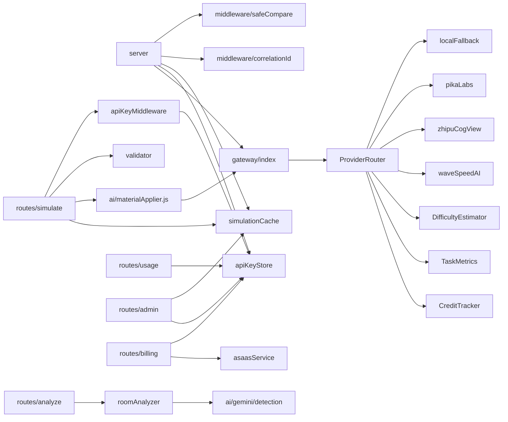

# PisoRealView Pro — Arquitetura do Backend

> Documento gerado em Abril/2026. Baseado na análise do código em `pisosrealview-pro-transformed/backend/`.

---

## Visão Geral

O backend do PisoRealView Pro é uma API REST em **Node.js (ESM)** com **Express**, responsável por:

1. Autenticar clientes via API Key
2. Analisar imagens de ambientes (roomAnalyzer)
3. Aplicar materiais de piso via IA (gateway multi-provedor)
4. Validar invariantes visuais do resultado (validator)
5. Gerenciar billing, créditos e planos (apiKeyStore + billing)

---

## Diagrama de Fluxo de Dados



---

## Módulos Principais

### 1. `server.js` — Ponto de Entrada

Responsabilidades:
- Inicialização do Express com middlewares globais
- Validação de variáveis de ambiente obrigatórias (`WAVESPEED_API_KEY`, `ADMIN_SECRET`)
- Configuração de segurança: `helmet` (CSP, frameguard, CORP, referrer-policy)
- Rate limiting por rota (produção): `/v1/analyze`, `/v1/simulate`, `/v1/auth`, `/v1/usage`, `/v1/billing`
- Registro de rotas e error handler global

Dependências diretas: `gateway/index.js`, `apiKeyStore.js`, `simulationCache.js`, `middleware/correlationId.js`, `middleware/safeCompare.js`

---

### 2. `gateway/ProviderRouter.js` — Roteador de Provedores (IRT-Router)

O coração do sistema de simulação. Implementa o padrão **IRT-Router** (Item Response Theory):

- Ordena provedores por `costTier` (menor custo primeiro)
- Estima dificuldade da requisição via `DifficultyEstimator`
- Consulta `TaskMetrics` para promover o provedor com melhor histórico (score > 0.7)
- Itera pelos provedores elegíveis com timeout configurável (`PROVIDER_TIMEOUT_MS`, padrão 45s)
- Retorna fallback textual se todos falharem

**Cascata de provedores:**
| Provedor | costTier | Fidelidade | API |
|---|---|---|---|
| WaveSpeedAI | 0 | 0.85 | Qwen Image Edit (async polling) |
| Zhipu CogView | 1 | 0.78 | cogview-3-flash |
| Pika Labs | 2 | 0.75 | pika.art v1/generate |
| local-fallback | — | 0.0 | Descrição textual |

---

### 3. `gateway/CreditTracker.js` — Controle de Créditos Free Tier

- Persiste contadores mensais em `credits.json`
- Rollover automático ao virar o mês
- Verifica se o provedor atingiu `freeCreditLimit`
- Injetável via construtor (testável com clock e fs mockados)

---

### 4. `gateway/DifficultyEstimator.js` — Estimador de Dificuldade

Classifica cada requisição em `low / medium / high` com base em:

| Fator | Peso |
|---|---|
| Tamanho da imagem (> 600KB) | +2 |
| Tamanho da imagem (> 150KB) | +1 |
| Dimensões não-padrão do material | +1 |
| Cena complexa (> 5 objetos) | +2 |
| Cena moderada (> 2 objetos) | +1 |
| Iluminação desconhecida | +1 |

Score ≤ 1 → `low` | Score 2–3 → `medium` | Score ≥ 4 → `high`

---

### 5. `gateway/TaskMetrics.js` — Métricas de Desempenho (BEST-Route)

Implementa score composto inspirado em **BEST-Route (ICML 2025)**:

```
score = successRate × (0.5 × avgFidelity + 0.3 × latencyScore + 0.2 × costEfficiency)
```

- Persiste em `task-metrics.json`
- Usado pelo `ProviderRouter` para promover o melhor provedor histórico
- Exposto via `GET /admin/metrics`

---

### 6. `core/simulationCache.js` — Cache de Simulações

- Cache em memória (`Map`) com TTL configurável (`SIMULATION_CACHE_TTL_MS`, padrão 30min)
- Chave: SHA256 de `imageBase64 + material.type + material.color + material.dimensions`
- Capacidade máxima configurável (`SIMULATION_CACHE_MAX_ENTRIES`, padrão 100)
- Evição: remove expirados primeiro, depois o mais antigo (LRU simples)
- Expõe `getSimulationCacheStats()` para o endpoint admin

---

### 7. `core/validator.js` — Validador de Invariantes Visuais

Arquitetura **gerador-verificador** com 4 invariantes independentes:

| Invariante | Threshold | Método |
|---|---|---|
| `shadows` | 0.70 | Bhattacharyya distance nos pixels escuros (0–80) |
| `geometry` | 0.80 | Ratio de tamanho + histograma global |
| `objects` | 0.75 | Bhattacharyya nos pixels médios (80–200) |
| `perspective` | 0.85 | Bhattacharyya nos pixels claros (200–255) |

- Cache interno de resultados (SHA256, TTL 5min, max 500 entradas)
- Retorna `{ violated, invariant, scores, overallScore }`

---

### 8. `core/roomAnalyzer.ts` — Analisador de Geometria

- Integração com **Gemini** via `services/ai/gemini/detection.ts`
- Fallback baseado em proporção da imagem se Gemini falhar
- Retorna: `geometry`, `obstacles`, `lighting`, `floorArea`, `roomType`

---

### 9. `services/apiKeyStore.js` — Gerenciamento de API Keys

- Armazenamento em `data/api-keys.json` (MVP — migrar para Redis/DB em produção)
- Planos: `trial (50)`, `basic (200)`, `popular (500)`, `pro (1000)`, `enterprise (3000)`, `demo (10/dia)`
- Trial: créditos decrementais (sem rollover mensal)
- Demo: rollover diário UTC automático via `ensureDemoClient()`
- Geração de keys: `sk_live_` + 16 bytes aleatórios

---

### 10. `middleware/apiKey.js` — Autenticação por API Key

- Lê `X-API-Key` do header
- Modo demo: bypass com `x-demo-mode: true` ou path `/demo`
- Verifica ativação, plano e limite de uso
- Injeta `req.client` para uso nas rotas
- Warning header `X-Usage-Warning` quando uso ≥ 80% do limite

---

### 11. `services/billing/asaasService.js` — Integração de Pagamentos

- Integração com **Asaas** (gateway de pagamento brasileiro)
- Webhook em `POST /v1/billing/webhook`
- Gerencia ciclo de vida: trial → pagamento → ativação de plano

---

## Mapa de Dependências



---

## Decisões Técnicas (ADRs)

### ADR-001: Cache de Simulações com SHA256 + Material

**Contexto:** Chamadas ao WaveSpeedAI custam ~$0.01–0.05 e levam 10–45s. Usuários frequentemente testam o mesmo material na mesma imagem.

**Decisão:** Cache em memória com chave SHA256 derivada de `imageBase64 + type + color + dimensions`. TTL de 30 minutos, máximo 100 entradas.

**Consequências:** Redução de custos e latência para requisições repetidas. Limitação: cache não sobrevive a restart do processo. Próximo passo: Redis para persistência.

---

### ADR-002: Cascata Multi-Provedor com IRT-Router

**Contexto:** Nenhum provedor de IA é 100% confiável. WaveSpeedAI é o mais barato mas pode falhar ou ter timeout.

**Decisão:** Cascata ordenada por `costTier` (menor custo primeiro), com promoção dinâmica baseada em histórico de performance (`TaskMetrics`). Fallback textual garante que o usuário sempre recebe uma resposta.

**Consequências:** Resiliência a falhas de provedores individuais. Custo otimizado (tenta gratuito primeiro). Complexidade adicional no roteamento.

---

### ADR-003: Estimativa de Dificuldade para Roteamento Inteligente

**Contexto:** Imagens complexas (muitos objetos, iluminação difícil) têm maior chance de falha em provedores de menor qualidade.

**Decisão:** `DifficultyEstimator` classifica cada requisição em `low/medium/high` e define `minCostTier`. Tarefas `high` pulam provedores gratuitos diretamente.

**Consequências:** Melhor taxa de sucesso em cenas complexas. Custo ligeiramente maior para tarefas difíceis.

---

### ADR-004: Validação de Invariantes Visuais

**Contexto:** Provedores de IA podem alterar elementos da cena além do piso (móveis, sombras, perspectiva).

**Decisão:** Validação pós-geração com 4 invariantes baseadas em histogramas de luminância (Bhattacharyya distance). Thresholds conservadores para evitar falsos positivos.

**Consequências:** Garante qualidade mínima do resultado. Implementação atual é heurística (pixels); próximo passo é CLIP via Replicate para validação semântica real.

---

### ADR-005: Armazenamento de API Keys em JSON (MVP)

**Contexto:** MVP sem banco de dados. Necessidade de autenticação simples e rápida.

**Decisão:** Arquivo `data/api-keys.json` com leitura/escrita síncrona. Planos com limites mensais e trial com créditos decrementais.

**Consequências:** Simples de operar. Não escala para múltiplas instâncias (race condition em escrita). Migração para Redis/PostgreSQL planejada para produção.

---

### ADR-006: Segurança com Helmet + safeCompare

**Contexto:** API pública exposta à internet.

**Decisão:** `helmet` com CSP restritiva (whitelist de domínios de provedores), `frameguard: deny`, `referrerPolicy: no-referrer`. Comparação de tokens com `crypto.timingSafeEqual` via `safeCompare` para prevenir timing attacks.

**Consequências:** Proteção contra XSS, clickjacking e timing attacks. CSP pode precisar de ajuste ao adicionar novos provedores.

---

## Estrutura de Diretórios

```
backend/
├── server.js                    # Entry point, middlewares, rotas
├── routes/
│   ├── analyze.js               # POST /v1/analyze
│   ├── simulate.js              # POST /v1/simulate
│   ├── auth.js                  # POST /v1/auth/trial
│   ├── billing.js               # POST /v1/billing/webhook
│   ├── usage.js                 # GET  /v1/usage
│   └── admin.js                 # GET  /v1/admin/metrics
├── middleware/
│   ├── apiKey.js                # Autenticação X-API-Key
│   ├── correlationId.js         # Rastreamento de requisições
│   └── safeCompare.js           # Comparação segura de tokens
├── services/
│   ├── apiKeyStore.js           # CRUD de API keys (JSON)
│   ├── planConfig.js            # Configuração de planos/créditos
│   ├── gateway/
│   │   ├── index.js             # Facade do gateway
│   │   ├── ProviderRouter.js    # IRT-Router principal
│   │   ├── CreditTracker.js     # Controle de créditos free tier
│   │   ├── DifficultyEstimator.js # Classificação low/medium/high
│   │   ├── TaskMetrics.js       # BEST-Route score histórico
│   │   ├── logger.js            # Logging estruturado JSON
│   │   └── providers/
│   │       ├── waveSpeedAI.js   # Qwen Image Edit (costTier 0)
│   │       ├── zhipuCogView.js  # CogView-3-Flash (costTier 1)
│   │       ├── pikaLabs.js      # Pika Labs (costTier 2)
│   │       ├── cometAPI.js      # Comet API (costTier ?)
│   │       ├── localFallback.js # Fallback textual
│   │       └── index.js         # buildProviders()
│   ├── core/
│   │   ├── simulationCache.js   # Cache SHA256 + TTL
│   │   ├── validator.js         # Invariantes visuais
│   │   ├── roomAnalyzer.ts      # Análise de geometria
│   │   └── invariants/          # Validadores compostos (TS)
│   ├── ai/
│   │   ├── materialApplier.js   # Facade JS para gateway
│   │   ├── gemini/              # Integração Gemini (detecção)
│   │   └── rendering/           # materialApplier.ts (TS refactor)
│   └── billing/
│       └── asaasService.js      # Integração Asaas
└── data/
    └── api-keys.json            # Armazenamento de keys (MVP)
```

---

## Variáveis de Ambiente

| Variável | Obrigatória | Padrão | Descrição |
|---|---|---|---|
| `WAVESPEED_API_KEY` | ✅ | — | API key WaveSpeedAI |
| `ADMIN_SECRET` | ✅ | — | Token admin |
| `ZHIPU_API_KEY` | ❌ | — | API key Zhipu CogView |
| `PIKA_API_KEY` | ❌ | — | API key Pika Labs |
| `PORT` | ❌ | 3001 | Porta do servidor |
| `NODE_ENV` | ❌ | development | Ativa rate limiting em `production` |
| `CORS_ORIGIN` | ❌ | http://localhost:5173 | Origem permitida |
| `PROVIDER_TIMEOUT_MS` | ❌ | 45000 | Timeout por provedor |
| `SIMULATION_CACHE_TTL_MS` | ❌ | 1800000 | TTL do cache (30min) |
| `SIMULATION_CACHE_MAX_ENTRIES` | ❌ | 100 | Capacidade máxima do cache |
| `MAX_PAYLOAD_SIZE` | ❌ | 10mb | Limite de payload |
| `RATE_LIMIT_WINDOW_MS` | ❌ | 60000 | Janela do rate limiter |
| `RATE_LIMIT_MAX` | ❌ | 60 | Máx. requisições por janela |

---

*Documento gerado por análise estática do código. Atualizar após mudanças arquiteturais significativas.*
